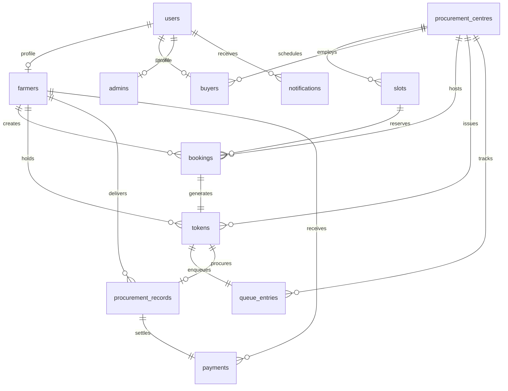

# AGRIQUENE Relational Database Schema Specification

AGRIQUENE is designed for PostgreSQL with SQLite for instant developer setup.

---

## Key Tables

### 1. `users`
- `id` (INTEGER, PK)
- `mobile_number` (VARCHAR(15), UNIQUE, INDEX)
- `email` (VARCHAR(100))
- `full_name` (VARCHAR(150))
- `role` (ENUM: `FARMER`, `BUYER`, `ADMIN`)
- `hashed_password` (VARCHAR(255))
- `is_active` (BOOLEAN)
- `created_at` (DATETIME)

### 2. `farmers`
- `id` (INTEGER, PK)
- `user_id` (INTEGER, FK `users.id`)
- `farmer_id_card` (VARCHAR(50), UNIQUE)
- `father_name` (VARCHAR(150))
- `address` (TEXT), `village`, `district`, `state`, `pin_code`
- `land_acres` (FLOAT)
- `bank_account_masked` (VARCHAR(30)), `ifsc_code` (VARCHAR(20))
- `preferred_crop` (VARCHAR(50))

### 3. `procurement_centres`
- `id` (INTEGER, PK)
- `name` (VARCHAR(200), INDEX), `code` (VARCHAR(50), UNIQUE)
- `address`, `district`, `state`, `pin_code`
- `latitude` (FLOAT), `longitude` (FLOAT)
- `capacity_per_day` (INTEGER), `active_counters` (INTEGER), `total_counters` (INTEGER)
- `avg_processing_time_min` (FLOAT), `workload_pct` (FLOAT)
- `status` (ENUM: `OPEN`, `BUSY`, `CLOSED`)

### 4. `tokens` & `queue_entries`
- `id` (INTEGER, PK), `token_number` (INTEGER), `token_display` (VARCHAR(20))
- `booking_id` (INTEGER, FK `bookings.id`), `farmer_id`, `centre_id`, `slot_id`
- `status` (ENUM: `WAITING`, `ARRIVED`, `CALLED`, `PROCESSING`, `COMPLETED`, `SKIPPED`)
- `current_position` (INTEGER), `initial_position` (INTEGER)
- `called_at`, `arrived_at`, `started_at`, `completed_at`

### 5. `procurement_records` & `payments`
- `id` (INTEGER, PK), `token_id`, `farmer_id`, `centre_id`, `buyer_id`
- `crop_name`, `gross_weight_quintals`, `tare_weight_quintals`, `net_weight_quintals`
- `moisture_pct`, `quality_grade`, `base_msp`, `bonus_amount`, `total_amount`
- `receipt_number` (VARCHAR(50), UNIQUE)
- `payment`: `transaction_ref`, `utr_number`, `amount`, `status` (ENUM: `PROCESSING`, `COMPLETED`)
